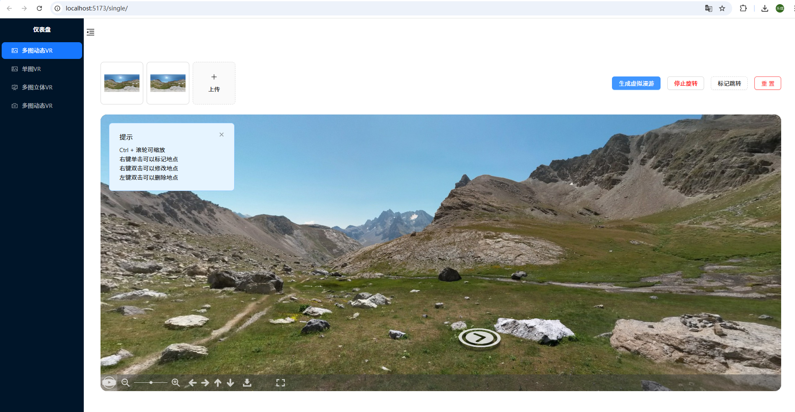
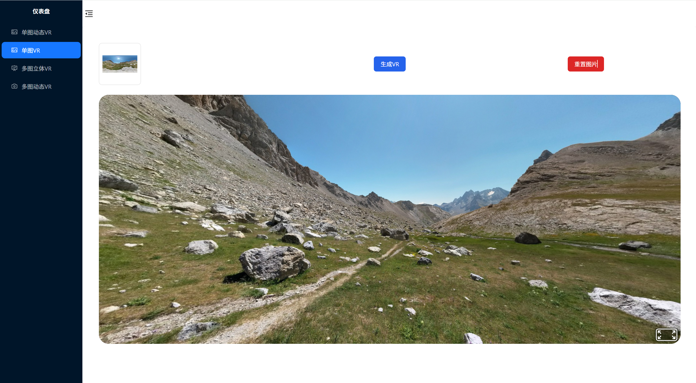
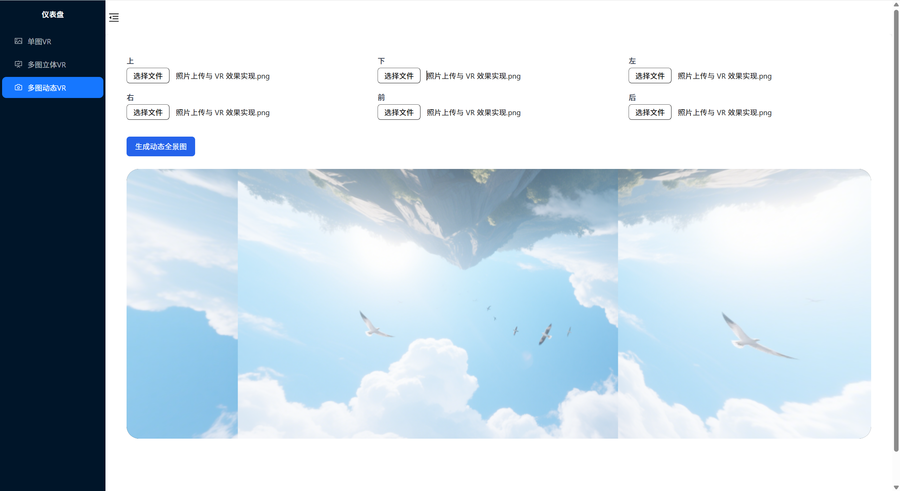

README.md

# 项目简介

该系统为 react + TS + tailwindcss + photo-sphere-viewer 的响应式 VR360 项目, 上传图片后可实现手动旋转 3D 图片,还包含了 6 贴图立方体展示和 6 贴图动态展示







# 安装依赖

```bash
npm install
```

# 运行项目

```bash
npm run dev
```

# 注意

1.photo-sphere-viewer 目前 v5 版本不稳定,npm 中最新版本为 4.8.1,官网地址 https://photo-sphere-viewer.js.org/ 要切换为 v4 版本

2.默认配置器选择为等距矩形可处理等矩形图(2:1 的比例)和圆形图(正方形圆形),当传递手机拍摄的照片(9:16/3:4 的比例)时会存在 VR 效果不太完美的情况
