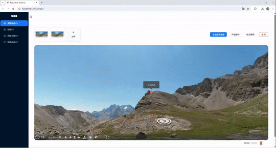

README.md

# 项目简介

该系统为 react + TS + tailwindcss + photo-sphere-viewer / A-Frame / Three.js 的响应式 VR360 项目, 上传图片后可实现手动旋转 3D 图片,还包含了 6 贴图立方体展示和 6 贴图动态展示 , gif 操作步骤为 A 页面新增且编辑 2 标记后切换 B,B 新增且编辑 1 标记后切到 A





# 项目亮点

通过 photo-sphere-viewer(v5) / A-Frame / Three.js 分别实现了 3D VR 效果 , 可根据具体需求选择不同的技术栈 , 其中本项目的主要功能是通过 photo-sphere-viewer(v5)实现了标记功能+虚拟漫游
。其中标记功能包括右键单击可新增标记 , 右键双击可修改标记 tooltip , 左键双击可删除标记 , 点击按钮"标记跳转"可进行标记间跳转 , 标记列表可查询全部标记 。其中虚拟漫游包括从 A 页面切换到 B 页面,再从 B 页面切换到 A 页面,实现虚拟漫游功能 ; 当 VR 中存在标记时数据漫游会跳转到最后一标记处。

# 安装依赖

```bash
npm install
```

# 运行项目

```bash
npm run dev
```

# 注意

一、在单图动态 VR 模块(技术栈为 photo-sphere-viewer v5) , 也是本系统的主页面

1.问题 : 加载完实例以后自动旋转
原因 : VirtualTourPlugin 在执行 setCurrentNode() 的时候，会自动触发一次 autorotate.start(),算是一个坑
解决 :找到监听事件(v5 用 addeventlistener)加入阻止旋转未成功,重置按钮状态,用按钮来控制自动旋转 2.情况:数据漫游和标记组件有冲突

问题 2.1:增加标记功能后,标记功能未生效
原因: 虚拟漫游插件会覆盖场景
解决:在漫游渲染之后监听标记事件

问题 2.2:A 页面修改完标记 tooltip 后切换虚拟漫游回到 A,修改的 tooltip 内容会消失,视角为默认视角
解决: markerMap 中要同步更新 tooltip 数据; node-changed 的监听中判断有无标记跳转视角

3.问题:虚拟场景切换后,自定义标签内容消失了
解决: 创建一个 markerMap，用于记录每个场景的标记列表。在用户点击时，将标记存入对应场景 ID 下。监听 node-changed，切换场景时重新加载该场景的标记

4.问题:当我点击漫游按钮时却默认标记了一处地点 , 我需要更改为右键单击漫游按钮实现跳转
解决 : 使用原生 dom 事件监听右键

二、在单图 VR 模块(技术栈为 A-Frame)

1.当前的路径为临时生成的 blob URL(blob:http://localhost:5173/xxx)在本地浏览器上下文中和 img 中有效,不适用于 WebGL 的纹理贴图,改用 base64 格式

三、在俩个多图 VR 模块(技术栈为 Three.js)

1.6 张贴图尺寸不一时会报错警告

四、默认账号密码为 admin/123456
