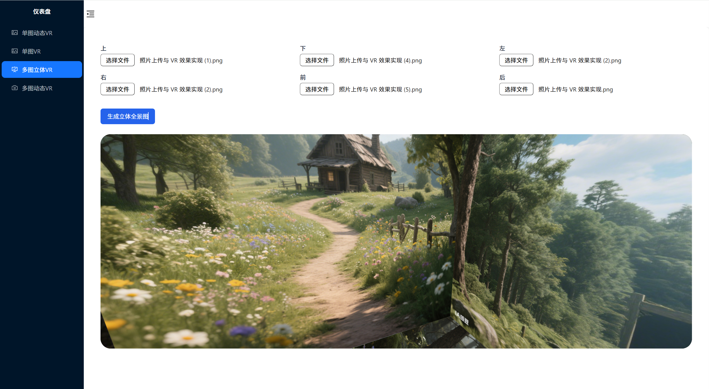

README.md

# 项目简介

该系统为 react + TS + tailwindcss + photo-sphere-viewer / A-Frame / Three.js 的响应式 VR360 项目, 上传图片后可实现手动旋转 3D 图片,还包含了 6 贴图立方体展示和 6 贴图动态展示





# 项目亮点

通过 photo-sphere-viewer / A-Frame / Three.js 分别实现了 3D VR 效果 , 可根据具体需求选择不同的技术栈

# 安装依赖

```bash
npm install
```

# 运行项目

```bash
npm run dev
```

# 注意

一.在单图动态 VR 模块(技术栈为 photo-sphere-viewer)

1.photo-sphere-viewer 目前 v5 版本不稳定,npm 中最新版本为 4.8.1,官网地址 https://photo-sphere-viewer.js.org/ 要切换为 v4 版本

2.默认配置器选择为等距矩形可处理等矩形图(2:1 的比例)和圆形图(正方形圆形),当传递手机拍摄的照片(9:16/3:4 的比例)时会存在 VR 效果不太完美的情况

3.自动旋转功能(即项目中的"开始巡检")也是通过 v4 的写法实现,如果按照 v5 官网写法会报错

二.在单独 VR 模块(技术栈为 A-Frame)

1.当前的路径为临时生成的 blob URL(blob:http://localhost:5173/xxx)在本地浏览器上下文中和 img 中有效,不适用于 WebGL 的纹理贴图,改用 base64 格式

三.在俩个多图 VR 模块(技术栈为 Three.js)

1.6 张贴图尺寸不一时会报错警告
